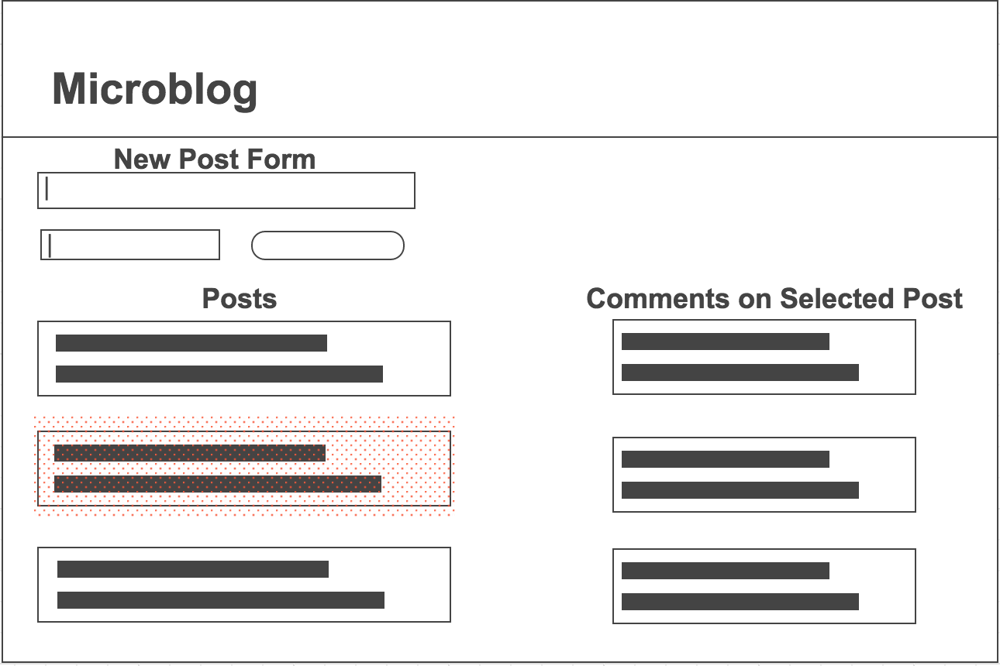

# Mongoose Relationships Lab

**Objective:** Add embedded comment data and referenced author data to your microblog project.

Each post "has one" author and "has many" comments.

## Basic Challenges

### Models

**Goal: set up or update schema and models in models file**

1. Create a schema and a model for Comment data. The Comment schema should include at least the text of the comment.

1. Create a schema and a model for Author data. The Author schema should include at least the name of the author.

1. Update the Post schema to include a list of embedded Comments.

1. Update the Post schema to include a reference to one Author. If you have an author attribute, replace it.

### Server Code

**Goal: add basic routes for making and reading embedded comments**

1. Make a route to read the comments on one blog post: `GET /api/posts/:postid/comments`. When the server receives a request at this route, it should:

  * query the database to find the post indicated by the id

  * send the post's comments as the JSON response

1. Make a route to create a new comment on a blog post: `POST /api/posts/:postid/comments`.  When the server receives a request at this route, it should:

  * query the database to find the post indicated by the id

  * create a new comment record

  * add the new comment to the post's list of embedded comments

  * send the new comment as the JSON response

**Goal: add basic routes for referenced authors**

1. Make a route to get all authors: `GET /api/authors`. When the server receives a request at this route, it should:

  * query the database to find all authors

  * send the authors as the JSON response

1. Make a route to create a new author: `POST /api/authors`. When the server receives a request at this route, it should:

  * make a new author

  * save the new author in the database

  * send the new author as the JSON response

1. Make a route to assign a specific author to a specific post: `PUT /api/posts/:postid/authors/:authorid`. When the server receives a request at this route, it should:

  * query the database to find the author

  * query the database to find the post

  * update the post to reference the author

  * send the updated post as the JSON response

### Client-Side Code

**Goal: Update your view to show all the comments on a post when the post is clicked.**

1. Set up a place in your `index.html` to display comments.
Hint: How about a new column off to one side that shows all the comments for the last clicked post?

    

1. Add a click event listener to tell when a post is clicked. Hint: check out the delete button click event listeners in one of the sample projects.

1. Update your click event listener to include an AJAX call to `GET` all the comments for the blog post from your API when a post is clicked.

1. Use jQuery and Underscore templating to render the comments in the view.

Note: You may notice some bugs (for example, comments don't disappear when you delete their post). Don't worry about them for now.

###Stretch Challenges: Server Code

1. Make a route to update a single comment: `PUT /api/posts/:postid/comments/:commentid`.  When the server receives a request at this route, it should:

  * query the database to find the comment indicated by the id

  * update the comment

  * save the comment

  * send the updated comment as a JSON response

1. Make a route to delete a single comment: `DELETE /api/posts/:postid/comments/:commentid`.  When the server receives a request at this route, it should:

  * query the database to find and the post indicated by the id

  * remove the specified comment from the post's list of embedded Comments

  * query the database to find and remove the comment

  * send the deleted comment as the JSON response (or send a status 200 - your choice)

### Stretch Challenges: Client-Side Code

**Goal: display a new comment form when the post is clicked.**

1. Set up a place in your `index.html` to display the new comment form. Hint: How about over in the comments div?

1. Update your post click event listener to use jQuery and Underscore templating to render the form in the view.

1. Add a jQuery submit event handler on the form.

1. Update your new comment form event handler to `POST` the data to your API. Hint: which route creates a new comment for a post?

## Readings and Submission

###Evening Reading

Read Salted [Password Hashing - Doing it Right](https://crackstation.net/hashing-security.htm), sections: "What is password hashing?", "How Hashes are Cracked", "Adding Salt".

###Submission

Submit the link for your microblog repo on github, along with any comments, in [the HW form](https://docs.google.com/a/generalassemb.ly/forms/d/14rNXnDaq5X5Rvda-1BRZCl9YmkOoZzf7oxGBEZG_YJE/viewform).
