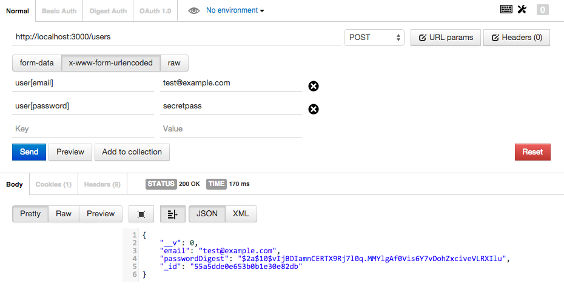
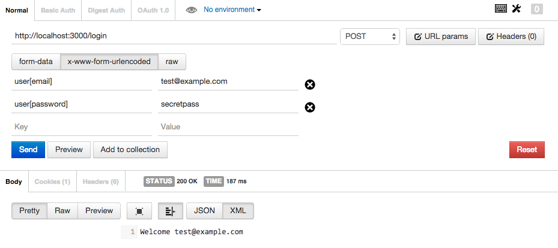
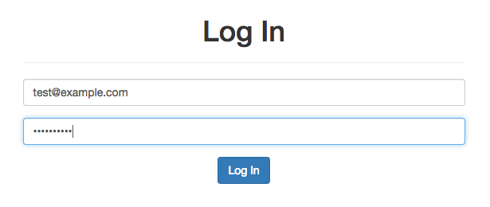

# Authentication with Express & Bcrypt

| Objectives |
| :--- |
| Implement a password **authentication** strategy with bcrypt |
| Saved a logged-in user's data to the session |
| Implement routes for a user to `/login` and `/logout` |

## Authentication & Authorization

* **Authentication** verifies that a user is who they say they are. When a user logs into our site, we *authenticate* them by checking that the password they typed in matches the password we have stored for them.
* **Authorization** is the process of determining whether or not a user has *permission* to to perform certain actions on our site. For example, a user may *be authorized* to view their profile page and edit their own blog posts, but not to edit another user's blog posts.

## Why do we hash (and salt) passwords?

In order to authenticate a user, we need to store their password in our database. This allows us to check that the user typed in the correct password when logging into our site.

The downside is that if anyone ever got access to our database, they would also have access to all of our users' login information. We use a <a href="https://crackstation.net/hashing-security.htm#normalhashing" target="_blank">hashing algorithm</a> to avoid storing plain-text passwords in the database. We also use a <a href="https://crackstation.net/hashing-security.htm#salt" target="_blank">salt</a> to randomize the hashing algorithm, providing extra security against potential attacks.


## Implementing Authentication

To give users the ability to sign up and log in to our site, we'll need:

* **Express:** for building our application and handling requests
* **Middleware:**
  * `body-parser`: for handling incoming form data
  * `express-session`: for setting sessions and cookies
* **Mongoose Models:** for CRUD-ing users and setting up authentication methods
* <a href="https://github.com/ncb000gt/node.bcrypt.js" target="_blank">**bcrypt:**</a> for hashing users' passwords

## Challenges: Part 1

**Goal:** Create a new Node/Express project.

1. In the terminal, initialize a new Node project and install `express`, `body-parser`, and `ejs`.

  ```
  $ mkdir simple_login
  $ cd simple_login
  $ npm init
  $ npm install --save express body-parser ejs
  $ touch server.js
  ```  

  **Note:** <a href="https://github.com/mde/ejs" target="_blank">`ejs`</a> is a server-side templating engine that allows us to render views from our server with dynamic data. We won't worry about the dynamic data part too much in this project - we'll be using `ejs` to render the views in our application.

2. Open your project in Sublime, and set up your server in `server.js` with the following code snippet:

  ```js
  // server.js

  // require express framework and additional modules
  var express = require('express'),
    app = express(),
    ejs = require('ejs'),
    bodyParser = require('body-parser');

  // set view engine for server-side templating
  app.set('view engine', 'ejs');

  // middleware
  app.use(bodyParser.urlencoded({extended: true}));

  // signup route with placeholder response
  app.get('/signup', function (req, res) {
    res.send('coming soon');
  });

  // listen on port 3000
  app.listen(3000, function () {
    console.log('server started on locahost:3000');
  });
  ```

3. In the terminal, run `nodemon` and make sure your server starts without any errors. If you get an error, read the line number and error message. Most likely, you're trying to use an undefined variable or a module that's not installed.

  ```
  $ nodemon
  ```

  **Note:** Keep `nodemon` running the entire time you're developing your application. When you need to execute other terminal commands, press `command + T` to open a new terminal tab.

## Challenges: Part 2

Goal: Write a `UserSchema` and define a `User` model.

1. In the terminal, create a new directory for `models` and create a file for your `User` model.

  ```
  $ mkdir models
  $ touch models/user.js
  ```

2. Also in the terminal, install `mongoose` and `bcrypt`.

  ```
  $ npm install --save mongoose bcrypt
  ```

3. In Sublime, open `user.js` and require your newly installed dependencies, `mongoose` and `bcrypt`.

  ```js
  // user.js

  // require dependencies
  var mongoose = require('mongoose'),
    Schema = mongoose.Schema,
    bcrypt = require('bcrypt'),
    salt = bcrypt.genSaltSync(10);
  ```

  **NOTE:** `bcrypt`'s `genSaltSync` function provides the salt we'll use to randomize the hashing algorithm.

4. Also in `user.js`, write your `UserSchema`. Users should have the properties **email** and **passwordDigest**.

  ```js
  // user.js

  // define user schema
  var UserSchema = new Schema({
    email: String,
    passwordDigest: String
  });
  ```

5. Continuing in `user.js`, define a `User` model using your `UserSchema` and export the model (so we can require it in other parts of our application).

  ```js
  // user.js

  // define user model
  var User = mongoose.model('User', UserSchema);
  
  // export user model
  module.exports = User;
  ```

## Challenges: Part 3

**Goal:** Define user authentication methods for our `UserSchema`.

1. In `user.js`, define methods for our `UserSchema`. These methods handle creating a user with a secure (hashed) password and authenticating a user.

   **Note:** We use `UserSchema.statics` to define <a href="http://mongoosejs.com/docs/guide#statics" target="_blank">static methods</a> for our schema and `UserSchema.methods` to define <a href="http://mongoosejs.com/docs/guide#methods" target="_blank">instance methods</a> for our schema. Static methods can hold any functionality related to the collection, while instance methods define functionality related to individual documents in the collection. You can think of instance methods like prototype methods in OOP!

  ```js
  // user.js
  
  // create a new user with secure (hashed) password
  UserSchema.statics.createSecure = function (email, password, callback) {
    // `this` references our schema
    // store it in variable `that` because `this` changes context in nested callbacks
    var that = this;
    
    // hash password user enters at sign up
    bcrypt.genSalt(function (err, salt) {
      bcrypt.hash(password, salt, function (err, hash) {
        console.log(hash);
        
        // create the new user (save to db) with hashed password
        that.create({
          email: email,
          passwordDigest: hash
        }, callback);
      });
    });
  };

  // authenticate user (when user logs in)
  UserSchema.statics.authenticate = function (email, password, callback) {
    // find user by email entered at log in
    this.findOne({email: email}, function (err, user) {
      console.log(user);
      
      // throw error if can't find user
      if (user === null) {
        throw new Error('Can\'t find user with email ' + email);
      
      // if found user, check if password is correct
      } else if (user.checkPassword(password)) {
        callback(null, user);
      }
    });
  };

  // compare password user enters with hashed password (`passwordDigest`)
  UserSchema.methods.checkPassword = function (password) {
    // run hashing algorithm (with salt) on password user enters in order to compare with `passwordDigest`
    return bcrypt.compareSync(password, this.passwordDigest);
  };
  ```
  
## Challenges: Part 4

**Goal:** Add a route to create users with secure (hashed) passwords.

1. In `server.js`, require `mongoose` and your `User` model.

  ```js
  // server.js

  var express = require('express'),
      app = express(),
      ejs = require('ejs'),
      bodyParser = require('body-parser'),
      // new additions
      mongoose = require('mongoose'),
      User = require('./models/user');
  ```

2. Also in `server.js`, connect to your `test` database.

  ```js
  // server.js

  // connect to mongodb
  mongoose.connect('mongodb://localhost/test');
  ```

3. Continuing in `server.js` add a `POST /users` route to accept user sign up requests.

  ```js
  // server.js

  // user submits the signup form
  app.post('/users', function (req, res) {

    // grab user data from params (req.body)
    var newUser = req.body.user;

    // create new user with secure password
    User.createSecure(newUser.email, newUser.password, function (err, user) {
      res.send(user);
    });
  });
  ```

4. At this point, your complete `server.js` code should look like the following:

  ```js
  // server.js

  // require express framework and additional modules
  var express = require('express'),
    app = express(),
    ejs = require('ejs'),
    bodyParser = require('body-parser'),
    mongoose = require('mongoose'),
    User = require('./models/user');

  // connect to mongodb
  mongoose.connect('mongodb://localhost/test');

  // set view engine for server-side templating
  app.set('view engine', 'ejs');

  // middleware
  app.use(bodyParser.urlencoded({extended: true}));

  // signup route with placeholder response
  app.get('/signup', function (req, res) {
    res.send('coming soon');
  });

  // user submits the signup form
  app.post('/users', function (req, res) {

    // grab user data from params (req.body)
    var newUser = req.body.user;

    // create new user with secure password
    User.createSecure(newUser.email, newUser.password, function (err, user) {
      res.send(user);
    });
  });

  // listen on port 3000
  app.listen(3000, function () {
    console.log('server started on locahost:3000');
  });
  ```

5. Test your `POST /users` route with Postman. Check that it creates a new user with a secure (hashed) password.

  **Note:** Make sure you have `nodemon` and `mongod` running. Double-check the params you enter into Postman. They should be `user[email]` and `user[password]`.

  

## Challenges: Part 5

**Goal:** Add a route to log in users.

1. In `server.js`, add a `POST /login` route to authenticate a user.

  ```js
  // server.js

  // user submits the login form
  app.post('/login', function (req, res) {
  
    // grab user data from params (req.body)
    var userData = req.body.user;

    // call authenticate function to check if password user entered is correct
    User.authenticate(userData.email, userData.password, function (err, user) {
      res.send(user);
    });
  });
  ```

2. Test your `POST /login` route with Postman by trying to log in the user you created in Part 5. Check that it sends the authenticated user as a response. Again, your parameters should be `user[email]` and `user[password]`.

  

## Challenges: Part 6

**Goal:** Set up sessions and cookies to keep track of logged-in users throughout your app.

1. In the terminal, install `express-session`.

  ```
  $ npm install --save express-session
  ```

2. In `server.js`, require `express-session` and set the session options. <a href="https://github.com/expressjs/session#options" target="_blank">Read more about the session options.</a>

  ```js
  // server.js

  var express = require('express'),
      app = express(),
      ejs = require('ejs'),
      bodyParser = require('body-parser'),
      mongoose = require('mongoose'),
      User = require('./models/user'),
      // new addition
      session = require('express-session');

  // middleware (new addition)
  // set session options
  app.use(session({
    saveUninitialized: true,
    resave: true,
    secret: 'SuperSecretCookie',
    cookie: { maxAge: 60000 }
  }));
  ```

3. Now that you have `express-session` set up, define the middleware `req.login`, `req.currentUser`, and `req.logout` in `server.js` to manage sessions.

  **Note:** `app.use` allows us to define our own middleware and the base path to exectue that middleware. Since our base path is `/`, this middleware will be executed with every request. You can think of this "session" middleware as helper functions that we have access to in every request to our server.

  ```js
  // server.js

  // middleware to manage sessions
  app.use('/', function (req, res, next) {
    // saves userId in session for logged-in user
    req.login = function (user) {
      req.session.userId = user.id;
    };

    // finds user currently logged in based on `session.userId`
    req.currentUser = function (callback) {
      User.findOne({_id: req.session.userId}, function (err, user) {
        req.user = user;
        callback(null, user);
      });
    };

    // destroy `session.userId` to log out user
    req.logout = function () {
      req.session.userId = null;
      req.user = null;
    };

    next();
  });
  ```

## Challenges: Part 7

Goal: Refactor the `POST /login` route to set the session and redirect to a user profile page.

1. After authenticating a user, log them in by calling `req.login(user)`, and redirect to the user's profile page. In `server.js`, your `POST /login` route should now look like this:

  ```js
  // server.js

  // user submits the login form
  app.post('/login', function (req, res) {

    // grab user data from params (req.body)
    var userData = req.body.user;

    // call authenticate function to check if password user entered is correct
    User.authenticate(userData.email, userData.password, function (err, user) {
      // saves user id to session
      req.login(user);

      // redirect to user profile
      res.redirect('/profile');
    });
  });
  ```

2. In the step above, we're redirecting to a route called `/profile`, which we don't have yet, so go ahead and set it up in `server.js`. For now, our profile route will respond with a welcome message.

  ```js
  // server.js
  
  // user profile page
  app.get('/profile', function (req, res) {
    // finds user currently logged in
    req.currentUser(function (err, user) {
      res.send('Welcome ' + user.email);
    });
  });
  ```

3. Test `POST /login` again with Postman, this time making sure you see the welcome message response from the redirect to `/profile`.

  

## Challenges: Part 8

**Goal:** Set up a login view to test your login functionality in the browser.

1. In the terminal, make a `views` directory and a view called `login.ejs`.

  **Note:** We're using the <a href="https://github.com/mde/ejs" target="_blank">ejs</a> view engine to easily render files from our server. This means no more `res.sendFile`!

  ```
  $ mkdir views
  $ touch views/login.ejs
  ```

2. In Sublime, open `login.ejs` and add this login form boilerplate. Writing ejs is no different from HTML, but the file must have the `.ejs` extension.

  ```
  <!DOCTYPE html>
  <html lang="en">
  <head>
    <meta charset="UTF-8">
    <meta name="viewport" content="width=device-width, initial-scale=1">

    <!-- bootstrap css -->
    <link type="text/css" rel="stylesheet" href="https://maxcdn.bootstrapcdn.com/bootstrap/3.3.5/css/bootstrap.min.css">

    <title>Simple Login</title>
  </head>
  <body>
    <div class="container text-center">
      <div class="row">
        <div class="col-md-6 col-md-offset-3">
          <h1>Log In</h1>
          <hr>
          
          <!-- note: method and action refer to the request type (post) and request url (/login) -->
          <form method="post" action="/login">
            <div class="form-group">
            
              <!-- note: the `name` HTML attribute sends form data to the server -->
              <!-- setting the names `user[email]` and `user[password]` allows us to use `req.body.user` on the server-side, which gives us a user object with `email` and `password` keys -->
              <input type="text" name="user[email]" class="form-control" placeholder="Email" autofocus>
            </div>
            <div class="form-group">
              <input type="password" name="user[password]" class="form-control" placeholder="Password">
            </div>
            <div class="form-group">
              <input type="submit" value="Log In" class="btn btn-primary">
            </div>
          </form>
        </div>
      </div>
    </div>
  </body>
  </html>
  ```

3. Now that the login view is ready, it's time for a login route. In `server.js`, set up `GET /login` to render the `login` view.

  ```js
  // server.js

  // login route (renders login view)
  app.get('/login', function (req, res) {
    res.render('login');
  });
  ```

4. Test that you can go to `localhost:3000/login` and successfully log in your user that you created via Postman. After logging in, you should be redirected to `/profile` with the welcome message response.

  


## Stretch Challenges

1. Right now, the `GET /signup` route has a placeholder response. Refactor the route to render a `signup` view. **Hint:** The `signup` view will have a form similar to the `login` view.

2. Test that a new user can sign up via the form on the `signup` page.

3. After a new user signs up, redirect them to `/login`. Test the user-flow of signing up, then logging in. After logging in, the user should still be redirected to `/profile` with the welcome message response.

4. Create a route `GET /logout` that uses the `req.logout` middleware to destroy the session. Add a link on your site that logs out the user.

5. The `req.currentUser` middleware finds the user who is currently logged in. Use `req.currentUser` to *authorize* parts of your site.
  * Logged-in users should NOT be able to see the `/signup` or `/login` pages.
  * Users should only be able to see `/profile` when logged in.
  
  **Hint:** You'll need to add some logic when calling `req.currentUser` to check if a logged-in user was found. You'll want to use `res.redirect` if a user tries to perform an unauthorized action.